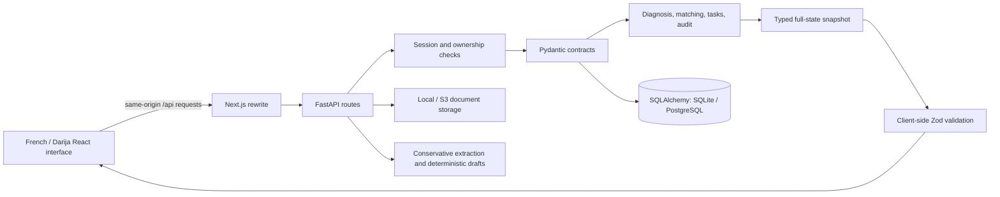

# Architecture

CampusPath AI is a Next.js 16 / React 19 frontend backed by a FastAPI application. It implements a stateful candidate preparation workflow. Its decision rules are deterministic and reviewable; external AI, admissions research, messaging, and submission services are not active integrations.

## Request and data flow

`src/app/page.tsx` owns the loaded snapshot, busy/error states, authentication screen, locale, and hash navigation. Related screens share `AppContext`. `src/lib/api.ts` handles same-origin requests and validates returned snapshots with Zod. On an unauthenticated initial load, it creates a fictional session only when the health endpoint reports demo mode enabled and the user has not explicitly logged out.

Next.js forwards `/api/*` to `API_INTERNAL_URL`. The browser sees one origin and does not receive backend credentials. API mutations return a freshly computed `Snapshot`: candidate, visible programs, completeness, academic diagnosis, matching, pathways, priorities, audit, and application cycle. This keeps the interface and business-rule results synchronized without duplicating scoring logic in the browser.

## Persistence model

SQLAlchemy defines relational tables for users, sessions, candidates, institutions, programs, documents, application cycles, and audit events. Most candidate and catalog details are Pydantic-validated JSON aggregates, not separately normalized relational entities.

| Stored object | Contents / relationship |
| --- | --- |
| User and session | Email, scrypt password hash, demo flag; hashed opaque session token, expiry, and user reference. |
| Candidate | Facts, education, grades, experiences, preferences, document metadata, clarification questions, selection history, claim overrides, narrative, artifacts, cycle, and revision. |
| Institution and program | Catalog data, institution relationship, source-bearing claims, and mock flags. |
| Document | Candidate owner, opaque storage key, detected MIME, and SHA-256 digest; file bytes reside in the storage adapter. |
| Cycle | Country/route reference, source, verification date, category and choice limits, motivation limit, optional deadline, and review state. |
| Audit event | Candidate, action, timestamp, and dossier revision. This is a mutation log, not a complete immutable forensic record. |

`CandidateRow.version` uses SQLAlchemy optimistic concurrency checks. A stale update returns HTTP 409. `persist()` revalidates the aggregate, records the action, commits, and rebuilds the snapshot. Relevant dossier changes increment the candidate revision and clear artifact approvals; a draft can only be approved against its current source revision.

Local development defaults to `backend/data/campuspath.db` and `backend/data/uploads/`. The same ORM can use PostgreSQL through `postgresql+psycopg`. Tables are created at startup with `create_all`; migration tooling, aggregate-to-table normalization, and SQLite-to-PostgreSQL data migration are future work.

## Evidence and readiness

Facts distinguish `SELF_DECLARED`, `NEEDS_REVIEW`, `VERIFIED`, `MISSING`, and `INCONSISTENT`. Verification requires an explicit candidate confirmation and document reference. Uploading a document does not verify its contents. A document can be reviewed, associated with an expected transcript semester, and its supported extraction imported after confirmation.

Completeness and verification are separate measures. Grades normalize their scale to 20 and use coefficients for weighted averages. No grades produces an unknown average; a genuine zero remains valid data. Academic checks identify missing semesters, unexplained interruptions, overlapping periods, and repeated levels.

Program claims store value, status, source URL, retrieval date, source type, and note. Matching exposes six weights—academic 30, prerequisites 25, language 15, project 15, geography 10, budget 5—and the proportion of known inputs. Missing dimensions are omitted from the score and reduce coverage. The score is a preparation heuristic; real selectivity is unknown. Explicit ineligibility, missing critical sources, insufficient language, unresolved questions, or unknown/expired deadlines block readiness independently of the score.

Program selection requires user confirmation and checks configured cycle/category limits. Narrative approval and program research gates precede motivation generation. Audit evaluates identity/contact data, reviewed documents, academic consistency, selection, current approved drafts, narrative, cycle, and unresolved questions. Demo completion yields `READY_DEMO`; a non-demo `READY` remains an internal checklist result.

## Isolation and authorization

Registered accounts start with empty candidate data and `is_demo=false`. Demo sessions create independent fictional candidates. Program queries filter `is_mock` against the authenticated candidate's demo flag. Program lookup and selection use that filtered list, so a real candidate cannot access a fictional program merely by providing its ID. The repository contains no real catalog import or administration endpoint.

Sessions use random opaque cookies with `HttpOnly`, `SameSite=Lax`, a 12-hour expiry, and token hashes stored in the database. Cookies use `Secure` outside demo mode. Mutation requests must include an exact allowed `Origin`. Registration and login use a small process-local rate limiter; it is not shared across workers. Document upload/review/download paths enforce candidate ownership. Uploads accept PDF/PNG/JPEG signatures, enforce a 10 MiB limit and 100-document cap, and detect duplicate file hashes per candidate.

Local storage resolves paths within its configured root. S3 keys are generated from candidate/document IDs; S3 writes request server-side AES-256 encryption. `DEMO_MODE=false` rejects SQLite at configuration time and local storage at startup. S3 credentials/bucket existence and PostgreSQL connectivity still need deployment-level verification; configuration guards alone do not validate an operational production deployment.

## Integration boundaries

`ai.py` defines `DocumentExtractor` and `StructuredLLM` protocols. `ReviewFirstExtractor` handles a narrow labelled-email pattern in machine-readable PDF text and returns `NEEDS_REVIEW` proposals. It does not perform image OCR or infer names, grades, or diplomas. Password-protected, scanned, malformed, or unrecognized documents lead to manual review guidance.

`cv_draft()` and `motivation_draft()` create text from stored information, attach evidence references, record the source revision, and return quality warnings. Export is `.txt` or browser print/PDF; a dedicated server PDF layout engine is not included. Interview feedback uses a word-count/project-reference rubric without speech analysis. `OpenAICompatibleStructuredLLM` contains an optional server-side JSON-schema request adapter, but no route instantiates it. Connecting an evaluated provider requires explicit wiring, provider error handling, factual-output checks, and regression coverage; setting environment credentials is insufficient.

`research.py` defines a typed `ResearchProvider` boundary. Its manual implementation raises `NotImplementedError` rather than retrieving arbitrary URLs. The product supports source inspection and a clarification workflow (`DRAFT → APPROVED → SENT → WAITING/ANSWERED → RESOLVED`). “Sent” records a candidate-declared external event. Replies and normalized conclusions are entered by the user; correspondence authenticity is not independently verified. Resolution creates a candidate-specific claim override, keeping it out of the shared catalog.

Application tracking similarly records externally observed states. No route sends email, contacts an institution, logs into Études en France, or submits a dossier. The optional browser `document.modelContext` registration exposes a read-only readiness summary when supported; it grants no mutation or submission capability.

## Validation and remaining work

The backend suite contains 59 passing tests for calculation and validation, evidence requirements, missing/expired information, mock isolation, sessions, cross-origin rejection, private downloads, duplicate uploads, approval invalidation, extraction confirmation, and workflow transitions. Frontend checks include TypeScript, ESLint, and the production build. An automated browser regression suite remains to be added. These checks do not substitute for live PostgreSQL/S3/OCR/LLM integration testing. See [verification results](VERIFICATION.md).

Before a public deployment, finish schema migrations, recovery and retention procedures, account recovery/deletion, robust multi-worker rate limiting, secure proxy/TLS configuration, upload threat scanning, observability, and an operational security assessment. A real program catalog also needs an owned ingestion/review process, dated official sources, and per-cycle rule maintenance. The reference rules researched on 2026-09-11 had limited direct-page access and deliberately leave the application deadline unconfirmed; they should not be rolled into a new intake automatically.
